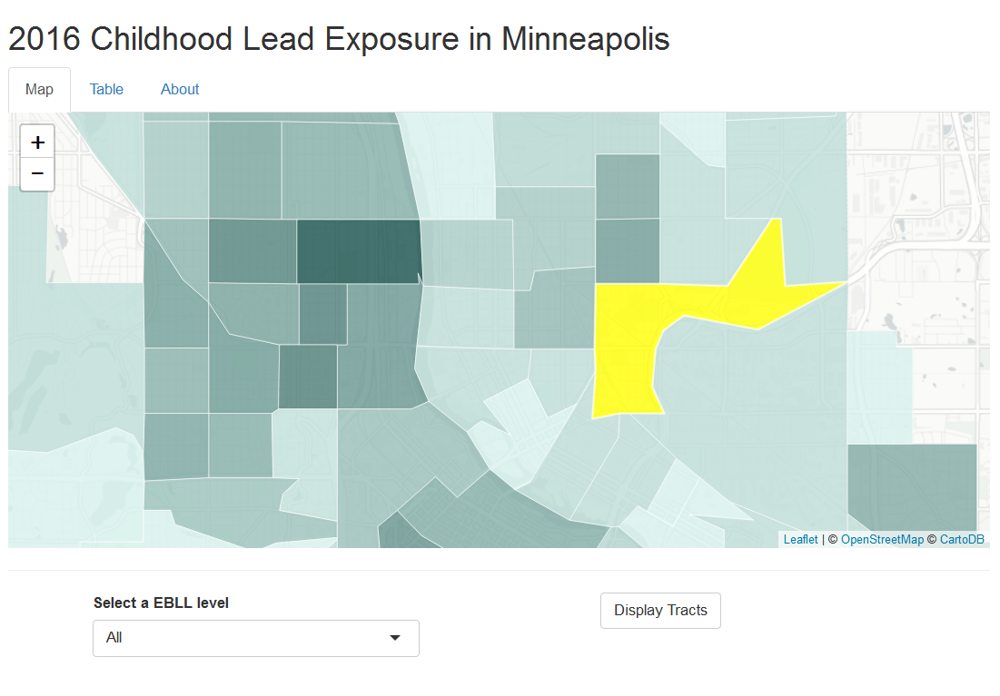
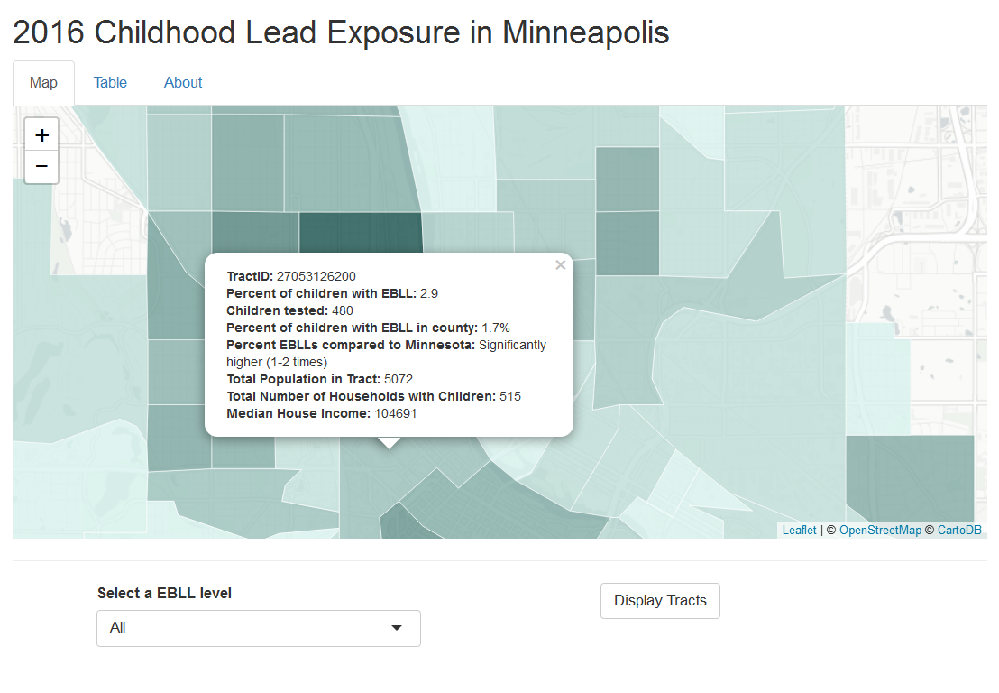

# MUSA620-Assignment5
A Shiny App using leaflet

### Children's lead exposure in Minneapolis 2016

This App shows the Children's lead exposure in Minneapolis using the Elevated blood lead level at census tract level. Elevated blood lead level (EBLL) is defined as a confirmed result at or above 5 micrograms of lead per deciliter of blood (mcg/dL).” EBLLs in young children are linked with adverse health effects, including learning problems, behavioral problems, and even death if exposures are very high. Children less than 6 years of age living in homes built before 1978 are most at risk for lead exposure. Younger children are at greater risk because their bodies absorb lead more easily and their brains are still developing.

In this App, by selecting an EBLL level then click display tracts, then the tracts with the selected EBLL would be added to the display, this gives residents a rough idea of how much their children are exposed to lead. 

#### How to use this App

By selecting a value in the drop down of the Elevated blood lead level, then click on Add Display, the tracts with this EBLL level would be added to display. Then by clicking on each tract, a more detailed set of this tract would pop up. 

#### Data behind the App

The Data behind the app is scraped from The [Minneapolis Department of Health](https://data.web.health.state.mn.us/lead). [Their interactive map](https://mndatamaps.web.health.state.mn.us/interactive/leadtract.html) has no census data, therefore, my app is to enrich the EBLL data with a census data background. The census data is downloaded from tidycensus. After cleaning and joining the data, they are stored in a database in PostgreSQL, the App is then taking the data from PostgreSQL directly when building the App. 
